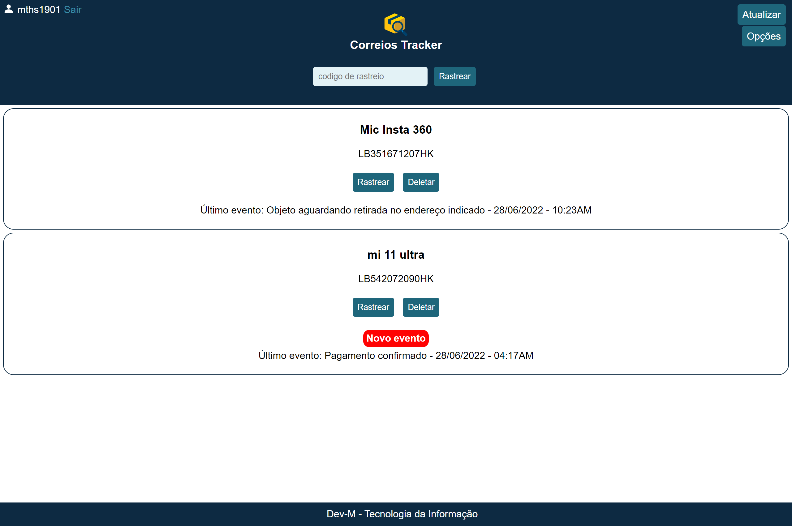
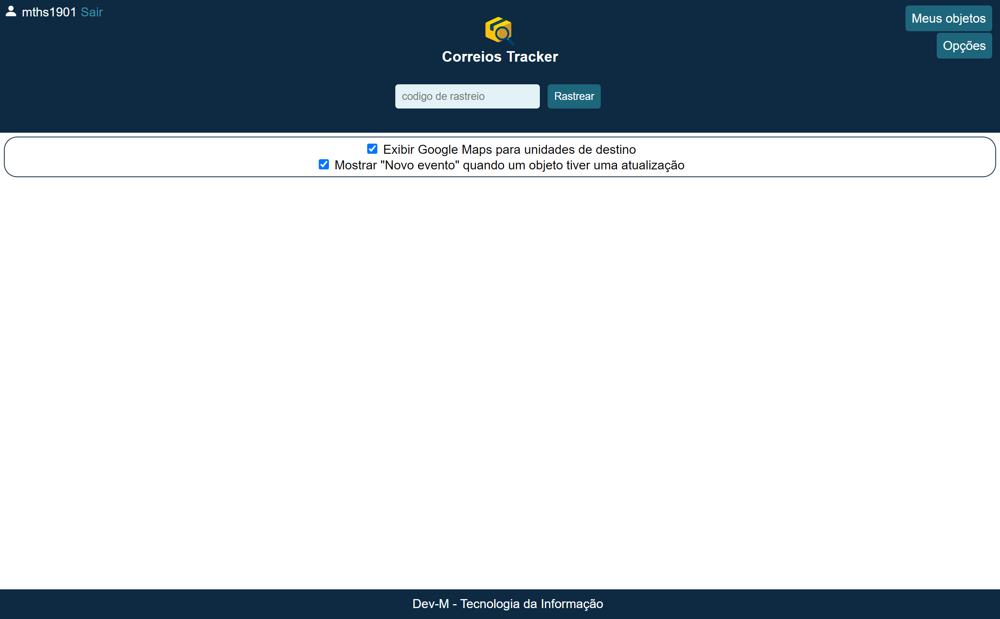
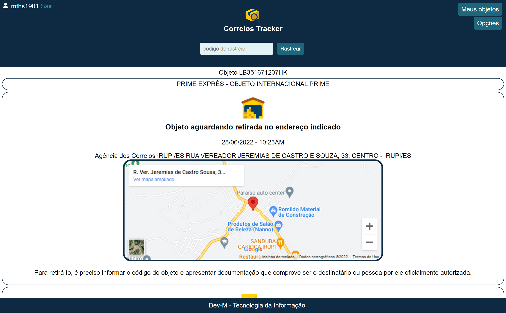

# correios-tracker
Rastreamento dos correios em Javascript e PHP com banco de dados simples.
#### isto é de um iniciante, brinco com isso nas horas vagas, não lembro oque mudei em cada versão... apenas anexo aqui para estudo para acompanhar minha própria evolução.

## Projeto permite rastreio de encomenda de uma forma extremamente fácil, podendo armazenar seus objetos em um usuário e senha para rastrear a qualquer momento.
#### Banco de dados simples (PHP), permite armazenar objetos em um usuário e senha.
#### Armazena visualizações de objetos.
#### Clique 5 vezes sobre o nome do seu usuário no canto superior esquerdo para ver quantos usuários estão usando o "sistema".
#### Exibe Google Maps (iframe mostrando local) para unidades de destino.
#### Mostrar "Novo evento" quando um objeto tiver uma atualização.

## Oque falta (pretendo colocar)?
#### Programar um service worker para enviar notificações.
#### Outros paranauê que não lembro.

Versão em funcionamento (dominio temporario): https://androgamer.org/app/correiostracker

Se você só quer saber como obtem resposta dos objetos diretamente dos correios em JSON, é isso, POST pego da versão mobile do aplicativo dos correios.
API: https://proxyapp.correios.com.br/v1/sro-rastro/${codigoDeRastreio} eu sei, isso irá te ajudar muito.

